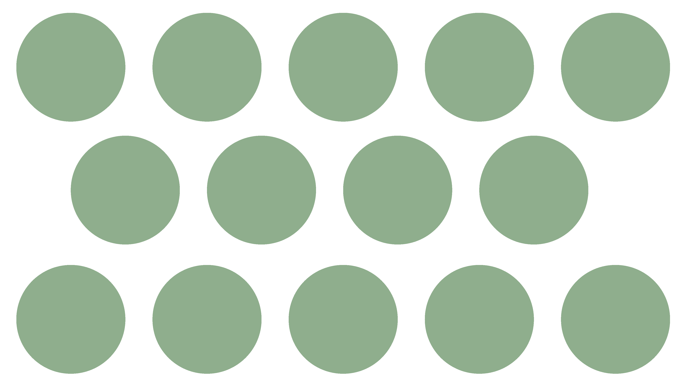
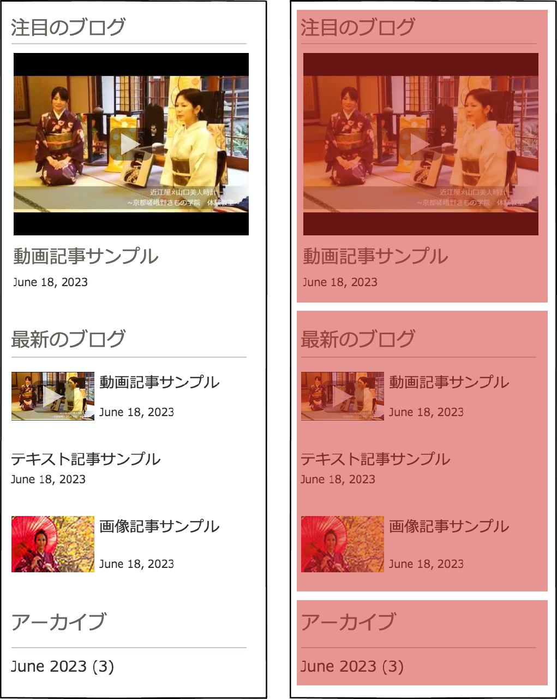
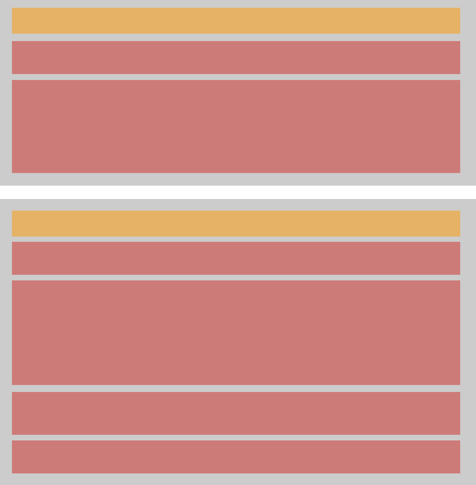

<div></div>

----

<h1 style="line-height:1.4;font-size:2em">柔軟なコンポーネント<br>設計のためのCSS</h1>

<p style="margin-bottom:0;padding-bottom:0">高津戸壮 <a href="https://twitter.com/Takazudo">@Takazudo</a></p>

----

# 自己紹介

<div style="display:table; width: 100%">
<div style="display:table-cell; vertical-align:middle; width:60%; vertical-align:top; padding:30px 0 0">
<ul>
<li>高津戸壮 (たかつど たけし)</li>
<li><a href="http://www.pxgrid.com/">株式会社ピクセルグリッド</a></li>
<li>フロントエンドエンジニア</li>
<li><a href="twitter.com/Takazudo">@Takazudo</a></li>
</ul>
</div>
<div style="display:table-cell; vertical-align:middle; width:40%"></div>
</div>

----

<ul style="font-size:2.2em;">
<li>さっさと</li>
<li>ぬかりなく</li>
<li>高品質に</li>
</ul>

<p style="font-size:1.8em; margin-top:.35em;">コーディングをこなすには？</p>

----

<p style="font-size:2.3em;">設計に迷いが<br>少ないこと</p>

----

# 設計に悩む

<ul style="font-size:1.5em; margin-top:.25em;">
<li>思い描く設計に落としこむ</li>
<li>設計は思い描け</li>
<li>そういう仕事だから</li>
</ul>

----


----


----

# 今日話すこと

<ol style="font-size:1.9em; margin-top:.25em;">
<li>ブロックの粒度</li>
<li>ブロックの拡張性</li>
<li>余白の設計</li>
</ol>

----

# とりあえず

<ul style="font-size:2.5em; margin-top:.3em">
<li>BEM</li>
<li>SMACSS</li>
</ul>

----

## 素敵に整理されたブロックの例

* [MailChimp - Pattern Library](http://ux.mailchimp.com/patterns/)
* [Lonely Planet - UI components](http://rizzo.lonelyplanet.com/styleguide/ui-components/badges)
* [DoSomething.org - Pattern Library](http://neue.dosomething.org/)

----

<span style="font-size:2em">私も素敵な設計にしたい</span><br><span style="font-size:2.1em">でも簡単にはいかない？</span><br><span style="font-size:5em">なんで？</span>

----

## とりあえず考えてみる


----

* [デモサイト1 : http://takazudo.wix.com/test1](http://takazudo.wix.com/test1)
* [デモサイト2 : http://takazudo.wix.com/test2](http://takazudo.wix.com/test2)
* [デモサイト3 : http://takazudo.wix.com/test4](http://takazudo.wix.com/test4)

----


---


---


---


---


----


---


---


---


----


---


---


---


---


----

<p style="font-size:2em">できた？<br>
そんな単純にいかない？<br>
なぜ？</p>

----

# 1. ブロックの粒度

----

<ul style="font-size:1.8em">
<li>適切な粒度の判断が必要</li>
<li>粒度とは？</li>
</ul>

----


----


----


----



----


----


----


---


---


---


----


----


----


---


---


---


----



---


---


---


---


---


---


----

<div style="display:table">
<div style="display:table-cell; vertical-align:middle; width:60%">
<h2>大きく分けた場合</h2>
<ul>
<li>単純</li>
<li>同じスタイルをコピペ</li>
<li>CSSのサイズ増える</li>
<li>巨大過ぎるブロック</li>
<li>Sassで裏でなんとかする<br>というのも可</li>
</ul>
</div>
<div style="display:table-cell; vertical-align:middle; width:40%">

</div>
</div>

---

<div style="display:table">
<div style="display:table-cell; vertical-align:middle; width:60%">
<h2>細かく分けた場合</h2>
<ul>
<li>複雑</li>
<li>同じ見栄えは同じHTML</li>
<li>無駄がない</li>
<li>CSSのサイズ減る</li>
</ul>
</div>
<div style="display:table-cell; vertical-align:middle; width:40%">

</div>
</div>

---

<div style="display:table">
<div style="display:table-cell; vertical-align:middle; width:60%">
<h2>どの程度<br>細かくするか</h2>
<ul>
<li>やろうと思えばいくらでも</li>
<li>複雑さは増す</li>
<li>他でそれ使う？</li>
<li>これ何に使うんだっけ…</li>
<li>3回出てきたら〜</li>
</ul>
</div>
<div style="display:table-cell; vertical-align:middle; width:40%">

</div>
</div>

---

<div style="display:table">
<div style="display:table-cell; vertical-align:middle; width:60%">
<h2>ブロックの入れ子</h2>
<ul>
<li>かなり複雑になり得る</li>
<li>デザインの意図と<br>あっているか？</li>
<li>複雑さを避けたいなら<br>デザイン的に<br>シンプルにするのも手</li>
</ul>
</div>
<div style="display:table-cell; vertical-align:middle; width:40%">

</div>
</div>

----

## 適度な粒度

* どうすればベストかは実現したいこと次第
* そのブロックは別のページでも利用されるか
* デザインを整頓して整理するつもりで

----

# 2. ブロックの拡張性

----


----


----

<p style="font-size:2em">そのブロックは<br>どのような<br>バリエーションを<br>持つべきか？</p>

----


---


---


---


---


----

<p style="font-size:2em">そのブロックの中には<br>何が入るのか？</p>

----


---


---


---


---


----

# 無限の拡張性を<br>もたせるのは無理


----

なるべく柔軟にしておく方が良いが…

* 無限に変化を持たせたい<br>それは何も決めてないのと同じ
* 無限の拡張性実現<br>それには無限の工数が必要
* どこまで必要か？
* 変化のパターンを決める
* 場合によっては直接style属性を利用

----


ボタンの大きさは3パターン

---


ボタンの色は3パターン

----

<p style="font-size:1.5em">変化のパターンを決めれば…</p>

<ul style="font-size:1.5em;margin-top:.25em">
<li>CSS単純になる</li>
<li>CSS容量減る</li>
<li>デザインルールが統一される</li>
</ul>

<p style="font-size:1.5em">※HTML+CSSだけの話ではない</p>

----

## とはいえ<br>なるべく柔軟にしておく

1. `display:table`を利用
2. なりゆきレイアウト
3. フィットするように縮む
4. 左右ひっくり返し

----

## 1. `display:table`を利用

```html
<table>
  <tr>
    <td>...</td>
    <td>...</td>
  </tr>
  <tr>
    <td>...</td>
    <td>...</td>
  </tr>
</table>
```

---

```html
<div class="table">
  <div class="tr">
    <div class="td">...</div>
    <div class="td">...</div>
  </div>
  <div class="tr">
    <div class="td">...</div>
    <div class="td">...</div>
  </div>
</div>
```

```
.table { display: table; }
.tr    { display: table-row; }
.td    { display: table-cell; }
```

---

```html
<div class="table">
  <div class="td">...</div>
  <div class="td">...</div>
</div>
```

```
.table { display: table; }
.td    { display: table-cell; }
```

※ IE7以下非対応

----

## 2. なりゆきレイアウト


---


---


----

## 3. フィットするように縮む


----

## 4. 左右ひっくり返し


<p style="padding:0;margin-bottom:-15px"></p>

---

<p style="padding:0;margin-bottom:-15px"></p>

```
<div class="splitter splitter--media-L">
    <div class="area media"></div>
    <div class="area text">The quick...</div>
</div>
```

<p style="padding:0;margin-bottom:-15px"></p>

```
<div class="splitter splitter--media-R">
    <div class="area media"></div>
    <div class="area text">The quick...</div>
</div>
```

---

<p style="padding:0;margin-bottom:-15px"></p>

```
<div class="splitter splitter--media-R">
    <div class="area media"></div>
    <div class="area text">The quick...</div>
</div>
```

```css
.splitter { display: table; }
.area     { display: table-cell; }
.text     { width: 100%; }

.splitter--media-R { direction: rtl; } /* 右から左 */
.splitter--media-R > * { direction: ltr; } /* 左から右 */
```

----

<p style="font-size:2em">
後の変更を見越し<br>可能な範囲で<br>柔軟性を持たせておく
</p>

----

# 3. 余白の設計

## ほとんどデザイン設計の話だが<br>CSSを書く上で非常に重要

----


----

<ul style="font-size:2.4em">
<li>マクロな余白設計</li>
<li>ミクロな余白設計</li>
</ul>

----


----


----

## マクロな余白設計

1. 汎用余白で単純積み上げパターン
2. 余白は別ブロックパターン
3. ブロック間余白無しパターン

----

## 1. 汎用余白で<br>単純積み上げパターン

統一された余白ルールを採用することで  
ブロックを積み上げるだけで  
ページを構成できるようにする

----


----


---


----

#### ブロックに応じて変化をもたせる


----

#### 時に上余白を設けて大きな余白を表現


----

* 入れ子を避けているのでページ構成が単純
* ルール化された美しさがある（と思う）
* より細かく余白制御をしたい場合は次

----

## 2. 余白は別ブロック<br>パターン

余白は別のブロックに切り離して  
考えることで柔軟に  
余白をデザインできる

----


---


---


----

#### section的余白表現


----


---


----

* 柔軟に余白をデザインできる
* 余白により多くの意味合いを<br>持たせることが出来る
* 常にブロックの入れ子になるので<br>比較的複雑

----

## 3. ブロック間余白<br>無しパターン

ブロック間の余白が無く積まれる  
デザインのパターン

----


----


---


----


---


----

<p style="font-size:1.7em">マクロな余白設計の指針は<br>
ブロックの構造、粒度決定の<br>
ヒントとなる</p>

----

## ミクロな余白制御

1. 足して帳尻パターン
2. ひっくり返しfirst-childパターン
3. last-childパターン
4. 有り無しの考慮

----

#### 入れ子構造になるブロックの例


---


---



---


----

## 1. 足して帳尻パターン

親の下paddingで調節

---


----

## 2. ひっくり返し<br>first-childパターン

子は上に余白、`:first-child`で  
1個目の子には適用させない

---


----

## 3. last-childパターン

子は下に余白、`:last-child`で  
最後の子には適用させない  
（IE8以下非対応）

---


----

## 4. 有り無しの考慮

必ず存在するエレメントを中心に  
余白を考える

---


---


---


----

* このブロックは削除されることがあるか？
* このエレメントは削除されることがあるか？
* どう余白をもたせたら破綻しないか？

<p style="font-size:1.5em">色々考慮する → 柔軟な設計</p>

----

<p style="font-size:2em">
美しい余白が<br>保たれるということは<br>
ちゃんと設計された<br>結果として実現される
</p>

----


----


# まとめ

----

<ul style="font-size:1.8em;">
<li>ブロックの粒度</li>
<li>ブロックの拡張性</li>
<li>余白の設計</li>
</ul>

<p style="font-size:1.8em">総合的に俯瞰して<br>設計の指針をたてる</p>

---

<p style="font-size:2em; margin-bottom:.35em;">そして</p>

<ul style="font-size:2em;">
<li>さっさと</li>
<li>ぬかりなく</li>
<li>高品質に</li>
</ul>

<p style="font-size:2em; margin-top:.35em;">コーディングをこなす</p>

----

# 実装以外の面

<ul style="font-size:1.3em">
<li>要件を詰めるコミュニケーション能力</li>
<li>運用を考慮</li>
<li>他分野とのコミュニケーション</li>
<li>良い成果物が活かせる仕事</li>
<li>自身／自社のブランディング</li>
</ul>

----

JavaScriptも重要だょ


----


---

* [CSS再入門 - display: tableの活用 1](https://app.codegrid.net/entry/css-table-1)
* [CSS再入門 - inline layout 1](https://app.codegrid.net/entry/inline-layout-1)
* [知っておきたいHTMLテンプレート設計法](https://app.codegrid.net/entry/oocss-1)


----

# ありがとう<br>ございました

----

<div></div>

----

<div style="text-align: left; font-size: .2em">
<h2>Photo credits</h2>
Crowded Capri Beach 1 by notFlunky<br>
https://www.flickr.com/photos/flunkster/2989134202<br>
<br>
Apples_2608 by Timothy Fuss<br>
https://www.flickr.com/photos/tjfuss/4412869141<br>
<br>
Pale bricks by Threepwood2012<br>
https://www.flickr.com/photos/threepwood2012/8070543748<br>
<br>
Egypt-12B-085 - Pyramid of Khafre by Dennis Jarvis<br>
https://www.flickr.com/photos/archer10/2216719429<br>
<br>
Dave's Bike Tools by Bre Pettis<br>
https://www.flickr.com/photos/bre/552152780<br>
<br>
Concrete Housing Construction in Chile by Concrete Forms<br>
https://www.flickr.com/photos/concrete_forms/523765240<br>
<br>
Athens plan of 1896 | Flickr - Photo Sharing!<br>
https://www.flickr.com/photos/athens_greece/7094730671/in/photolist-bNWmfB-6bDajt-itQgqG-e7qDPW-xhvKt-f4KSb9-4TMaB2-fXMCwt-e7k1gM-5UynR4-c5bD1y-dYT4aq-5UXpEm-9stgWB-f6bKbo-ebJJ6e-qdcBxA-cc6XaQ-9CWQV8-6bCYck-cc6Yps-fXMDek-sASWR-9CZLES-6iryjP-7F7K2F-7F7KwH-buoX4v-eARbRM-nMe8p8-bmDXKm-6YQGb3-5Di5dB-8aYR4d-7PqVgt-dXziJS-6ArL5m-88VDH3-bAX6cT-fzA9so-6iuWnh-7F7KdV-7FbBZJ-7FbBVL-8E29NU-6JMcST-5qURNk-2iQ2W-bbeRVi-7g9wNm<br>
<br>
Foster Kitchen Design-Floor Plan | Flickr - Photo Sharing!<br>
https://www.flickr.com/photos/therichardlife/4371919102<br>
<br>
Plate of Peas | Flickr - Photo Sharing!<br>
https://www.flickr.com/photos/haprog/4002891340<br>
<br>
peas | Flickr - Photo Sharing!<br>
https://www.flickr.com/photos/calliope/14534766085<br>
<br>
Beans - Magnified | Flickr - Photo Sharing!<br>
https://www.flickr.com/photos/29487672@N07/14585479999/in/photolist-odSp46-oQzYR1-bLepGx-6FzqUG-4CUntR-5zxCTW-hTggVg-athMJ5-6XDRPh-f9UF62-CoZGr-84Tm9g-4vwsiF-bnk4oC-6kszjz-nf4YZT-t9pEN-5dub-699sQE-84Qm7H-9TG6rw-9P8iJ-9qSjoV-fNFAB3-4yAZp9-jEPMHR-58PLUY-8GRzcL-fS7rEr-8xA69m-hLicLT-9ujKXk-cJxwSJ-ebq18-qKiVZt-f3UTn8-4PQKXL-e8zLn-5tVms4-gZcoet-7aqr3p-8LmodA-df4P8F-fN1GEQ-eeo9Ji-eddbs6-9raAkC-4uNY9k-bD2q93-4GrfGV<br>
<br>
Pinecone | Flickr - Photo Sharing!<br>
https://www.flickr.com/photos/makelessnoise/220378819/in/photolist-ktuWP-d8RFoG-nv3u4Y-8rxCNV-ngKtdJ-6dvNWL-6YZY9b-5eDzza-6cHfEK-5w7WqF-4fM7ak-dXEhTh-5oLpRC-yDGo5-4aoGNd-ndPF-4dtfx-5wchfj-79xAKo-qC7VqU-oWpLYq-pTcdGB-c7Zzhd-8XkdnY-82FyAx-fMrgh9-6YaX2C-bZJfkd-7xE2-88THja-8Xr8Jv-791DRx-6ykcUX-6cQuXg-5ip7Ut-4LXxg9-4DTKEf-3B4NWq-CQJAU-43rAV-t3mcj-cmchcw-euGC47-e7Ss5S-9hRXkC-fJhhSi-nmt9FX-ymVmL-ad2LNS-6zYkxx<br>
</div>

